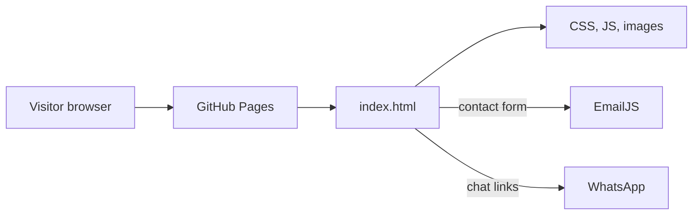

# Peak Academy — how this site works

Peak Academy is a one-page marketing site for SAP training. The whole site is static files: HTML, CSS, images, and JavaScript. There is no application server, database, framework, or build step. A browser opens `index.html`, and GitHub Pages publishes this folder as-is.

The visual design started from [TemplateMo 586 Scholar](https://templatemo.com/tm-586-scholar). Peak Academy content (courses, events, contact, WhatsApp) was written into that template.

## Request path

A push to the `main` branch runs `.github/workflows/static.yml`. That workflow checks out the repo, uploads the whole directory, and deploys it to the `github-pages` environment. Editing a file and merging to `main` is the release process.

## Repository map

| Path | Role |
| --- | --- |
| `index.html` | The only page. Markup, section anchors, and the contact-form script live here. |
| `assets/css/templatemo-scholar.css` | Site look: layout, header, banner, sections, WhatsApp button, contact block. |
| `assets/css/owl.css` | Styles for the two carousels. |
| `assets/css/fontawesome.css` | Icon font. Glyph files are in `assets/webfonts/`. |
| `assets/css/animate.css` | Animation helpers linked from the page. The carousels do not set `animateIn` / `animateOut`. |
| `assets/css/flex-slider.css` | Template leftover. The page does not link this file. |
| `assets/js/custom.js` | Page behavior: preloader, sticky header, mobile menu, smooth scroll, carousels. |
| `assets/js/owl-carousel.js` | Owl Carousel 2.3.4 library. `custom.js` calls it. |
| `assets/js/counter.js` | Number-count animation for the stats strip. |
| `assets/js/isotope.min.js` | Masonry/filter library. Wired in `custom.js`, with no filter buttons in the HTML. |
| `assets/images/` | Logos, course photos, event photos, banner backgrounds, decorative contact art. |
| `vendor/jquery/` | jQuery. The page loads `jquery.min.js`. |
| `vendor/bootstrap/` | Bootstrap CSS and JS. The FAQ accordion uses Bootstrap’s collapse. |
| `.github/workflows/static.yml` | Deploy to GitHub Pages on every push to `main`. |

## Page, top to bottom

Everything is one document. The header links jump to `id` anchors on the same page.

| Order | Anchor | What the visitor sees | Where it is defined |
| --- | --- | --- | --- |
| 1 | — | Loading dots, hidden after the window `load` event | `#js-preloader` |
| 2 | — | Sticky header: logo, Home / Services / Courses / Events / Contact Us | `header.header-area` |
| 3 | `#top` | Three-slide hero: coaching, SAP upskilling, SAP solutions | `.owl-banner` |
| 4 | `#services` | Three cards: classroom training, hands-on experience, SAP certification | `.services` |
| 5 | — | FAQ accordion plus the “About Us” copy | `.about-us`, `#accordionExample` |
| 6 | `#courses` | Three course cards: SAP FICO, SAP MM, SAP BODS | `#courses` |
| 7 | — | Animated counters: students, hours, employed students, years | `.fun-facts` |
| 8 | — | Three learner quotes in a carousel | `.owl-testimonials` |
| 9 | `#events` | Three upcoming programs with date and duration | `#events` |
| 10 | `#contact` | Contact copy, WhatsApp link, internship offer, name/email/phone form | `#contact` |
| 11 | — | Fixed WhatsApp button | `.whatsapp-chat` |
| 12 | — | Footer line: Peak Academy, a venture of Chiralph consulting private limited | `footer` |

Hero slide backgrounds come from CSS, not from `` tags:

- `.item-1` → `assets/images/banner-item-01.jpg`
- `.item-2` → `assets/images/banner-item-02.jpg`
- `.item-3` → `assets/images/banner-item-03.jpg`

The favicon is `assets/images/logo.svg`. The header logo image is `assets/images/peak_logo.png`.

## What the browser loads

Styles, in order, from the `<head>`:

1. Google Fonts (Poppins). The same font is also `@import`ed at the top of `templatemo-scholar.css`.
2. `vendor/bootstrap/css/bootstrap.min.css` — grid (`container`, `row`, `col-lg-*`) and the accordion.
3. `assets/css/fontawesome.css`
4. `assets/css/templatemo-scholar.css` — the theme that actually defines the page.
5. `assets/css/owl.css`
6. `assets/css/animate.css`
7. Swiper’s CSS from `unpkg.com`. The page has no Swiper markup and does not load Swiper’s JavaScript.

Scripts, in order, at the bottom of `<body>`:

1. `vendor/jquery/jquery.min.js` — required by almost every script below.
2. `vendor/bootstrap/js/bootstrap.min.js` — opens and closes the FAQ accordion (`data-bs-toggle="collapse"`).
3. `assets/js/isotope.min.js` — creates a masonry layout on `.event_box` (the course cards).
4. `assets/js/owl-carousel.js` — defines `$.fn.owlCarousel`.
5. `assets/js/counter.js` — defines `$.fn.countTo` and starts every `.timer`.
6. `assets/js/custom.js` — site behavior, including carousel setup.
7. EmailJS from `cdn.jsdelivr.net`, then two inline scripts: `emailjs.init(...)` and `sendEmail`.

## Behavior after load

`custom.js` runs inside a jQuery function. The pieces that match markup on this page:

**Preloader.** On `window` `load`, `#js-preloader` gets the class `loaded`, which fades the dots out. A second `load` handler also looks for `#preloader` and `.cover`. Those elements are not in `index.html`, so that second handler does nothing visible.

**Sticky header.** On scroll, if the visitor has passed the hero text, `header` gains `background-header` and the bar picks up a solid background.

**Mobile menu.** `.menu-trigger` toggles `.header-area .nav`. Crossing the 767px width boundary reloads the page so the desktop and mobile menus do not get stuck in the wrong state.

**In-page navigation.** Clicks on `.scroll-to-section a` animate the scroll to the matching `id`, about 80px above the section so the sticky header does not cover the heading. On a narrow screen the menu closes first. A scroll listener then marks the link whose section is in view with the class `active`.

**Carousels.** Both `.owl-banner` and `.owl-testimonials` are Owl Carousels: one slide at a time, looping, with left/right arrows. Owl Carousel is the library in `owl-carousel.js`; the two calls that create the sliders are in `custom.js`.

**Counters.** Each stat is an `h2.timer` with `data-to` (the final number) and `data-speed="1000"` (one second). `counter.js` counts from 0 to that number as soon as the document is ready, including when the strip is still below the fold.

**Courses layout.** If `.event_box` exists, Isotope lays out `.event_outer` cards in masonry mode. Filter clicks only run when `.event_filter` exists. This page has the box and no filter control, so the three course cards stay visible.

**Submenus.** `custom.js` also opens `.has-sub` dropdowns. The current menu is a flat list, so that code never attaches.

## Contact form

The form is `#contact-form`. Its `onsubmit` calls `sendEmail` in `index.html`. That function:

1. Calls `event.preventDefault()`, so the browser does not navigate away.
2. Reads `#name`, `#email`, and `#phone`.
3. Calls `emailjs.send` with service id `service_u3c8aan` and template id `template_iqtjjw5`.
4. Sends `from_name`, `reply_to` (the visitor’s email), `message` (the phone number), and `to_name` `"Peak Academy"`.
5. On success, shows an alert and resets the form. On failure, logs the error and shows a failure alert.

EmailJS is initialized with the public key `NQHEkUPgvisC9Jjr_`. That key is meant to live in the browser; the service and template are configured in the EmailJS dashboard, not in this repo. There is no local mail server.

The phone field requires exactly 10 digits (`pattern="[0-9]{10}"`). The email field uses a simple “something@something” pattern.

Two links open WhatsApp at `https://wa.me/8129356434`: the line in the contact section and the fixed button `.whatsapp-chat`.

## Where to change things

| Goal | Edit |
| --- | --- |
| Headline, course names, event dates, about copy, testimonials | The matching section in `index.html` |
| Colors, spacing, banner photos, header, WhatsApp button | `assets/css/templatemo-scholar.css` |
| Hero or testimonial slide behavior | The `.owlCarousel({...})` calls in `assets/js/custom.js` |
| Stat numbers | `data-to` on the `.timer` elements in `.fun-facts` |
| Who receives form mail, or the email wording | The EmailJS dashboard (service `service_u3c8aan`, template `template_iqtjjw5`), and the field map inside `sendEmail` |
| WhatsApp number | Both `https://wa.me/8129356434` links in `index.html` |
| Publish | Merge to `main`. The Pages workflow deploys the repository root. |

## Files the current page does not use

These shipped with the Scholar template or an earlier edit and are still in the tree:

- `assets/css/flex-slider.css` is not linked.
- Swiper CSS is linked; Swiper JS and Swiper markup are absent.
- Commented blocks in `index.html`: site search, a YouTube embed, a message textarea, and an older text logo.
- Images with no reference from `index.html` or the active CSS: `course-04.jpg` through `course-06.jpg`, `member-01.jpg` through `member-04.jpg`, `Peak_HD.jpg`, `whatsapp-logo.png`. `banner-bg.jpg` is only mentioned in a commented CSS rule.
- `vendor/jquery/jquery.js` and the slim builds are unused; the page loads `jquery.min.js`.
